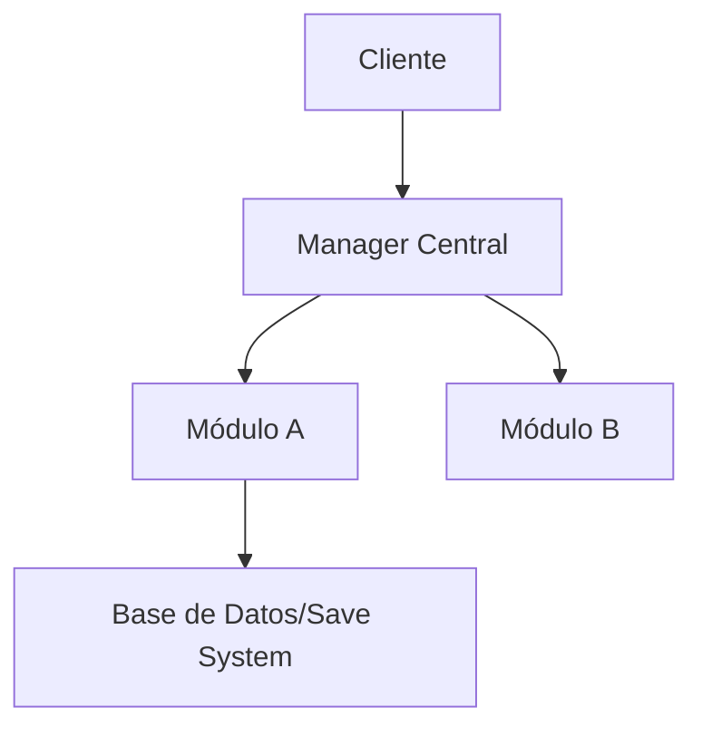

# 🏗️ Arquitectura Técnica: [Nombre del Módulo/Proyecto]

*El plano del edificio. Si esto falla, todo el juego se cae como un castillo de naipes.*

## 1. Visión General de la Infraestructura
*Descripción de alto nivel de cómo se organiza el código y los servicios.*

## 2. Diagrama de Arquitectura

## 3. Flujo de Datos
- **Entrada de datos:** [Inputs, Red, Archivos de configuración].
- **Procesamiento:** [Transformaciones clave].
- **Persistencia:** [Cómo y dónde se guarda la información].

## 4. Tecnologías y Librerías
- **Lenguaje:**
- **Frameworks/Librerías externas:** [Por qué las usamos].
- **APIs/Servicios:** [Integraciones con terceros].

## 5. Gestión de Estados
- **Estados Globales:** [Cargando, Menú, En Partida, Pausa].
- **Transiciones:** Cómo pasamos de un estado a otro de forma segura.

## 6. Seguridad y Validaciones (si aplica)
- **Validación en cliente vs servidor.**
- **Encriptación de datos sensibles.**

---
### Checklist de Arquitectura
- [ ] ¿Cumple con los principios SOLID? (o al menos lo intenta).
- [ ] ¿Es fácil de escalar si añadimos más contenido?
- [ ] ¿Están claras las responsabilidades de cada módulo?
- [ ] ¿Se ha revisado con el lead de programación?
